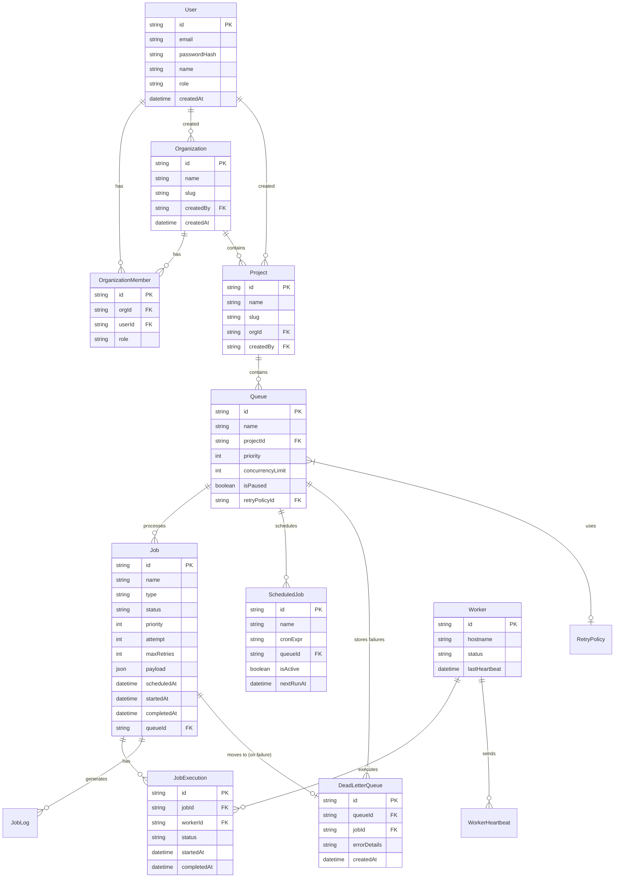

# Entity-Relationship (ER) Diagram

This diagram maps out the database structure for JobForge, showing all tables and how they relate to one another.

```mermaid
erDiagram
    User ||--o{ OrganizationMember : "has"
    User ||--o{ Organization : "created"
    User ||--o{ Project : "created"

    Organization ||--o{ OrganizationMember : "has"
    Organization ||--o{ Project : "contains"

    Project ||--o{ Queue : "contains"

    Queue ||--o{ Job : "processes"
    Queue ||--o{ ScheduledJob : "schedules"
    Queue ||--o{ DeadLetterQueue : "stores failures"
    Queue }|--o| RetryPolicy : "uses"

    Job ||--o{ JobExecution : "has"
    Job ||--o{ JobLog : "generates"
    Job ||--o| DeadLetterQueue : "moves to (on failure)"

    Worker ||--o{ JobExecution : "executes"
    Worker ||--o{ WorkerHeartbeat : "sends"

    User {
        string id PK
        string email
        string passwordHash
        string name
        string role
        datetime createdAt
    }
    Organization {
        string id PK
        string name
        string slug
        string createdBy FK
        datetime createdAt
    }
    OrganizationMember {
        string id PK
        string orgId FK
        string userId FK
        string role
    }
    Project {
        string id PK
        string name
        string slug
        string orgId FK
        string createdBy FK
    }
    Queue {
        string id PK
        string name
        string projectId FK
        int priority
        int concurrencyLimit
        boolean isPaused
        string retryPolicyId FK
    }
    Job {
        string id PK
        string name
        string type
        string status
        int priority
        int attempt
        int maxRetries
        json payload
        datetime scheduledAt
        datetime startedAt
        datetime completedAt
        string queueId FK
    }
    ScheduledJob {
        string id PK
        string name
        string cronExpr
        string queueId FK
        boolean isActive
        datetime nextRunAt
    }
    JobExecution {
        string id PK
        string jobId FK
        string workerId FK
        string status
        datetime startedAt
        datetime completedAt
    }
    DeadLetterQueue {
        string id PK
        string queueId FK
        string jobId FK
        string errorDetails
        datetime createdAt
    }
    Worker {
        string id PK
        string hostname
        string status
        datetime lastHeartbeat
    }
```
